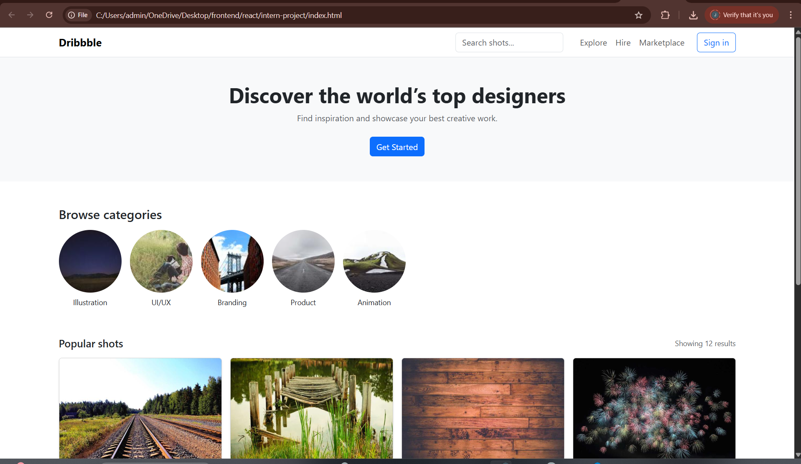
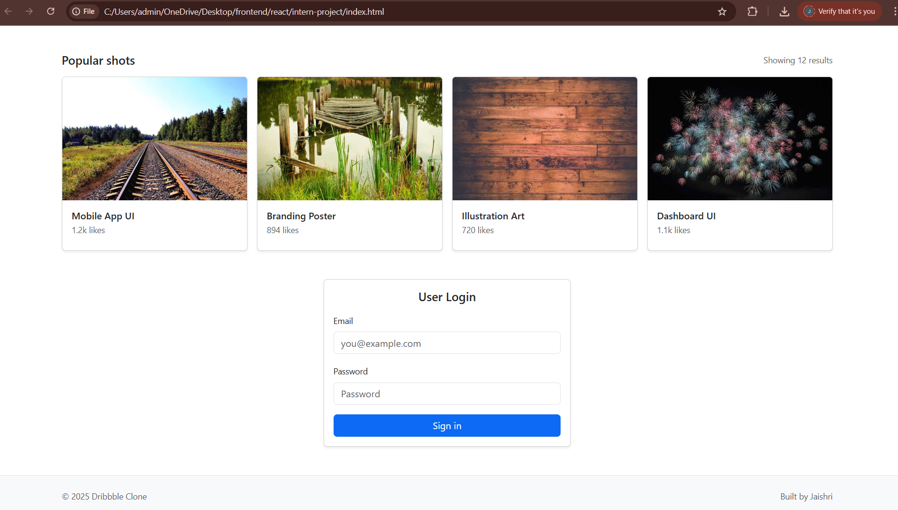

# Project Responsive Web Design using Bootstrap
## Date: 15/11/25

## AIM:
To create a simplified clone of Dribbble (https://dribbble.com/) landing page.


## DESIGN STEPS:

### Step 1:
Clone the repository from GitHub.

### Step 2:
Create Django Admin project.

### Step 3:
Create a New App under the Django Admin project.

### Step 4:
Insert the necessary CSS and JavaScript files as external in order to use Bootstrap.

### Step 5:
Create a HTML file and include the needed Bootstrap components.

### Step 6:
Publish the website in the LocalHost.

## PROGRAM :
```
<!doctype html>
<html lang="en">
<head>
  <meta charset="utf-8" />
  <meta name="viewport" content="width=device-width, initial-scale=1" />
  <title>Dribbble — Simple Clone</title>

  <!-- Bootstrap CSS -->
  <link href="https://cdn.jsdelivr.net/npm/bootstrap@5.3.2/dist/css/bootstrap.min.css" rel="stylesheet">
</head>
<body>

  <!-- Navbar -->
  <nav class="navbar navbar-expand-lg navbar-light bg-white border-bottom">
    <div class="container">
      <a class="navbar-brand fw-bold" href="#">Dribbble</a>

      <button class="navbar-toggler" type="button" data-bs-toggle="collapse" data-bs-target="#navMain"
        aria-controls="navMain" aria-expanded="false" aria-label="Toggle navigation">
        <span class="navbar-toggler-icon"></span>
      </button>

      <div class="collapse navbar-collapse" id="navMain">
        <form class="d-flex ms-auto my-2 my-lg-0" role="search">
          <input class="form-control me-2" type="search" placeholder="Search shots..." aria-label="Search">
        </form>

        <ul class="navbar-nav ms-3 mb-2 mb-lg-0 align-items-lg-center">
          <li class="nav-item"><a class="nav-link" href="#">Explore</a></li>
          <li class="nav-item"><a class="nav-link" href="#">Hire</a></li>
          <li class="nav-item"><a class="nav-link" href="#">Marketplace</a></li>
          <li class="nav-item"><a class="btn btn-outline-primary ms-lg-3" href="#">Sign in</a></li>
        </ul>
      </div>
    </div>
  </nav>

  <!-- Hero / Banner (no carousel) -->
  <section class="bg-light py-5 text-center">
    <div class="container">
      <h1 class="fw-bold">Discover the world’s top designers</h1>
      <p class="text-muted mb-4">Find inspiration and showcase your best creative work.</p>
      <a class="btn btn-primary" href="#">Get Started</a>
    </div>
  </section>

  <!-- Categories (Horizontal scroll) -->
  <section class="container my-5">
    <h4 class="mb-3">Browse categories</h4>
    <div class="d-flex gap-3 overflow-auto pb-2">
      <div class="text-center flex-shrink-0">
        
        <div class="small">Illustration</div>
      </div>
      <div class="text-center flex-shrink-0">
        
        <div class="small">UI/UX</div>
      </div>
      <div class="text-center flex-shrink-0">
        
        <div class="small">Branding</div>
      </div>
      <div class="text-center flex-shrink-0">
        
        <div class="small">Product</div>
      </div>
      <div class="text-center flex-shrink-0">
        
        <div class="small">Animation</div>
      </div>
    </div>
  </section>

  <!-- Grid of shots -->
  <main class="container mb-5">
    <div class="d-flex justify-content-between align-items-center mb-3">
      <h5 class="mb-0">Popular shots</h5>
      <div class="small text-muted">Showing 12 results</div>
    </div>

    <div class="row g-3">

      <!-- Card 1 -->
      <div class="col-12 col-sm-6 col-md-4 col-lg-3">
        <div class="card h-100 shadow-sm">
          
          <div class="card-body">
            <h6 class="card-title mb-1">Mobile App UI</h6>
            <p class="small text-muted mb-2">1.2k likes</p>
          </div>
        </div>
      </div>

      <!-- Card 2 -->
      <div class="col-12 col-sm-6 col-md-4 col-lg-3">
        <div class="card h-100 shadow-sm">
          
          <div class="card-body">
            <h6 class="card-title mb-1">Branding Poster</h6>
            <p class="small text-muted mb-2">894 likes</p>
          </div>
        </div>
      </div>

      <!-- Card 3 -->
      <div class="col-12 col-sm-6 col-md-4 col-lg-3">
        <div class="card h-100 shadow-sm">
          
          <div class="card-body">
            <h6 class="card-title mb-1">Illustration Art</h6>
            <p class="small text-muted mb-2">720 likes</p>
          </div>
        </div>
      </div>

      <!-- Card 4 -->
      <div class="col-12 col-sm-6 col-md-4 col-lg-3">
        <div class="card h-100 shadow-sm">
          
          <div class="card-body">
            <h6 class="card-title mb-1">Dashboard UI</h6>
            <p class="small text-muted mb-2">1.1k likes</p>
          </div>
        </div>
      </div>

    </div>
  </main>

  <!-- Login Card -->
  <section class="container mb-5">
    <div class="row justify-content-center">
      <div class="col-12 col-md-6 col-lg-4">
        <div class="card shadow-sm">
          <div class="card-body">
            <h5 class="card-title text-center mb-3">User Login</h5>
            <form>
              <div class="mb-3">
                <label class="form-label small">Email</label>
                <input type="email" class="form-control" placeholder="you@example.com">
              </div>
              <div class="mb-3">
                <label class="form-label small">Password</label>
                <input type="password" class="form-control" placeholder="Password">
              </div>
              <button class="btn btn-primary w-100">Sign in</button>
            </form>
          </div>
        </div>
      </div>
    </div>
  </section>

  <!-- Footer -->
  <footer class="bg-light border-top">
    <div class="container py-4 d-flex flex-column flex-md-row justify-content-between">
      <div class="small text-muted">© <span id="year"></span> Dribbble Clone</div>
      <div class="small text-muted">Built by Jaishri</div>
    </div>
  </footer>

  <!-- Bootstrap JS -->
  <script src="https://cdn.jsdelivr.net/npm/bootstrap@5.3.2/dist/js/bootstrap.bundle.min.js"></script>

  <script>
    document.getElementById("year").textContent = new Date().getFullYear();
  </script>

</body>
</html>
```

## OUTPUT:



## RESULT:
The Project for responsive web design using Bootstrap is completed successfully.
